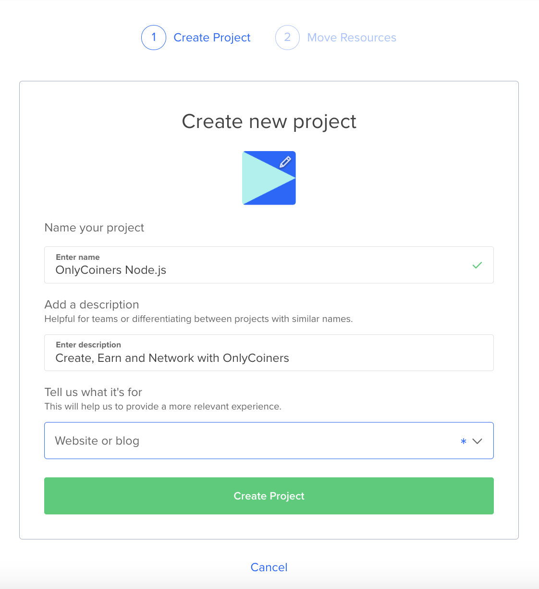
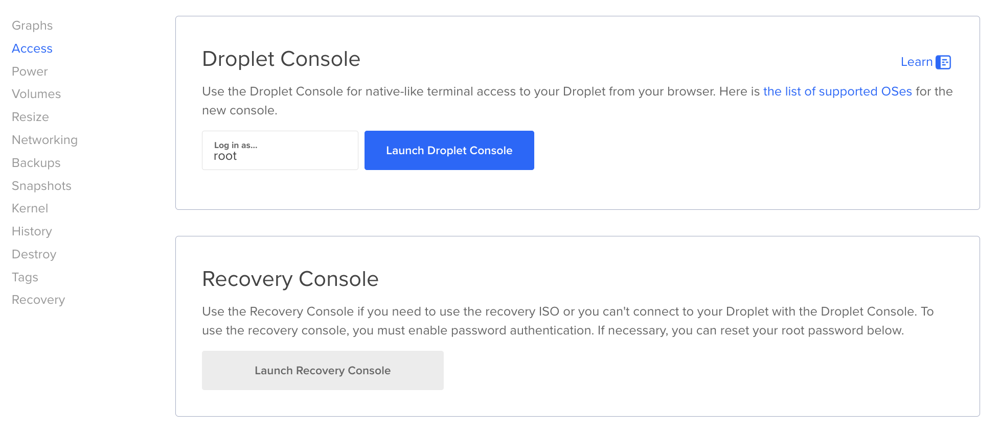

[OnlyCoiners]: https://www.onlycoiners.com
[OnlyCoiners Email]: mailto:dev@onlycoiners.com
[OnlyCoiners Job Board]: https://www.onlycoiners.com/jobs
[OnlyCoiners WhatsApp Group For Job Posts]: https://chat.whatsapp.com/F7sWgD6fpbE5mQASiSJZND
[DigitalOcean]: https://m.do.co/c/e0d6be6820ed
[EN]: https://www.onlycoiners.com/user/onlycoiners/blog/how-to-deploy-a-node-js-app-to-digitalocean-droplet-or-other

# How to Deploy a Node.js App to DigitalOcean Droplet or Other Linux VM


You can see the latest posts here.

- [EN]

Deploying a Node.js application to a DigitalOcean Droplet or any Linux virtual machine is important to make your project online. 

This guide uses **SSH**, **GitHub**, **PM2**, and **Nginx** for efficient and reliable deployment to deploy a Node.js app to DigitalOcean.

You can use it for other VM also.

We will use PM2 here mostly because it is already pre installed and working for the default set the DigitalOcena gives.

But, there are some reasons to use PM2 as well.

PM2 is a powerful process manager for Node.js applications, designed to make your life easier when running and managing production apps. It goes beyond simply starting your application—it provides a suite of features that ensure your app runs smoothly and reliably, even in the most demanding environments.

We have a [WhatsApp group for job posts][OnlyCoiners WhatsApp Group For Job Posts] using the process described in this post.

You can join it for latest jobs. You can also find and post jobs on [our job board][OnlyCoiners Job Board].

## Why You Should Use PM2

1. **Automatic Restart**  
   PM2 automatically restarts your app if it crashes, ensuring zero downtime. This is a lifesaver for production environments where reliability is critical.

2. **Process Management**  
   It allows you to manage multiple applications on a single server effortlessly. With simple commands like `pm2 start`, `stop`, `restart`, and `delete`, you have full control over your processes.

3. **Built-In Monitoring**  
   PM2 provides real-time monitoring of your app's performance, showing CPU and memory usage. This helps you identify bottlenecks and optimize your app.

4. **Startup Scripts**  
   When you reboot your server, PM2 ensures your apps start automatically by generating a startup script tailored to your system.

5. **Log Management**  
   PM2 consolidates logs from all your applications into one place. You can view, tail, or clear logs with a single command, making debugging much more manageable.

6. **Cluster Mode**  
   Want to utilize all CPU cores on your server? PM2's cluster mode makes it easy to scale your app horizontally, maximizing performance.

7. **Ease of Use**  
   With a clean and intuitive CLI, PM2 is beginner-friendly while still offering advanced features for experienced developers.

8. **Cross-Platform**  
   PM2 works seamlessly on various operating systems, including Linux, macOS, and Windows, making it a versatile choice for any environment.

PM2 has its robust features and simplicity make it a go-to solution for production deployments. Whether you're scaling a startup app or managing a high-traffic application, PM2 ensures stability and provides peace of mind. It empowers developers to focus on building features instead of worrying about process management, making it an invaluable tool in your arsenal.

## Prerequisites

1. **Node.js Application**: A ready-to-deploy Node.js app.
2. **DigitalOcean Droplet**: Set up with Ubuntu or similar.
3. **SSH Access**: Configured for secure login.
4. **Nginx**: For reverse proxy setup.

If you don't have any Node.js app to test, you can use our example.

```bash
$git clone https://github.com/OnlyCoiner/digitalocean_deployment_examples.git
$cd node
$yarn
$yarn test
$yarn dev 
```

## Set Up SSH and GitHub

1. **Create the Droplet**  


   
Create an account or log into [DigitalOcean] and create a Node.js Droplet. You can use its console and use the commands below.


   
Use its default `nodesource_setup.sh` script and you will have most of requirements ready including git, node, yarn or npm etc. Otherwise, you can install them manually as you did in your laptop.
     
```bash
./nodesource_setup.sh
```

2. **Transfer SSH Key**  

Save your SSH key `~/.ssh/your_private_key` to the Droplet or your VM to download your project from GitHub or others with $git pull command.

You can make one here https://github.com/settings/keys for GitHub if you don't have it yet.

```bash
$scp ~/.ssh/your_private_key root@<your-droplet-ip>:~/.ssh/
$chmod 600 ~/.ssh/your_private_key
```

3. **Configure SSH Access**  
   
Edit the SSH config file on your server.

This way, you can also push your updates to a git repository if you want to.

```bash
$vim ~/.ssh/config
```

Edit with the text below.

```text
Host github.com
  HostName github.com
  User git
  IdentityFile ~/.ssh/your_private_key
  AddKeysToAgent yes
```

4. **Clone the Repository**  

Clone your app from GitHub.

```bash
git clone https://github.com/OnlyCoiners/digitalocean_deployment_examples.git
```

## Use PM2 to Manage Your Node.js App

1. **Stop Default Apps**  

DigitalOcean’s default Node.js app may be running. Stop and delete it first.

```bash
$pm2 list
$pm2 stop hello
$pm2 delete hello
$pm2 save
$pm2 save --force
```

2. **Start Your Node.js App**  

Depending on your setup, use one of the following commands

```bash
$pm2 start npx --name onlycoiners_node -- tsx ./src/index.ts
```

You will see some logs from **pm2** and other messages in your console.

```bash
OnlyCoiners Node.js server is running on port 8888
```

3. **Save and Set Up PM2**  

```bash
$pm2 list
$pm2 save
$pm2 startup
```

Use `$pm2` list to see if your app is working and `$pm2` save to save your updates.

Use `$pm2 startup` to make your app working after you close your SSH connection to your droplet or VM.

4. **Check Logs**  

```bash
$pm2 logs
$pm2 logs onlycoiners_node
```

Your app might not be working at first attempt. Use `$pm2 logs` or `$pm2 logs <yourappname>` to debug. 

## Configure Nginx as a Reverse Proxy

1. **Edit Nginx Configuration**  

```bash
$sudo vim /etc/nginx/sites-available/default
```

Edit it to use the code snippet below instead and the port number for your app.

```nginx
server {
    listen 80 default_server;
    listen [::]:80 default_server;

    root /var/www/html;
    index index.html index.htm index.nginx-debian.html;

    server_name _;

    location ^~ /assets/ {
        gzip_static on;
        expires 12h;
        add_header Cache-Control public;
    }

    location / {
        proxy_http_version 1.1;
        proxy_cache_bypass $http_upgrade;

        proxy_set_header Upgrade $http_upgrade;
        proxy_set_header Connection 'upgrade';
        proxy_set_header Host $host;
        proxy_set_header X-Real-IP $remote_addr;
        proxy_set_header X-Forwarded-For $proxy_add_x_forwarded_for;
        proxy_set_header X-Forwarded-Proto $scheme;

        proxy_pass http://localhost:8888;
    }
}
```

This way, you will be able to curl to the IP for your project directly instead of assining your port number.

2. **Restart Nginx**  

After the update, restart your nginx for your update to work.

```bash
$sudo systemctl restart nginx
```

## Test Your Setup

1. **Verify Nginx and Node.js**  

Use `curl` to test whenever you make updates so you can test if it is working or not.

```bash
$curl localhost:8888  # Node.js app
$curl localhost       # Nginx reverse proxy

$curl <your-server-ip>
```

They should show all same results with "Create, Earn and Network with OnlyCoiners! Join us https://www.onlycoiners.com" or others depedning on your project.

Use `$curl <your-server-ip>` after you close SSH connectio to your droplet or VM to see if the app is still working after you close the connection.

2. **Check PM2 Status**  

Optionally, you can test PM2 is managing your app properly with these again.

```bash
$pm2 list
$pm2 logs
```

## Troubleshooting Tips

- Check application logs for errors:

```bash
$pm2 logs onlycoiners_node
```

- Ensure your SSH key and Nginx configuration are correct.

## Conclusion

Deploying a Node.js app to DigitalOcean or a Linux VM with **PM2** and **Nginx** ensures reliability and scalability. By following this guide, you’ll be able to make your project work with DigitalOcean or other Linux virtual machines.